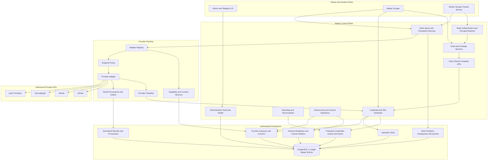

# Design Document: Multi-Search-Provider Platform and Durable Credential Rotation

## Overview

This design establishes an authorized multi-search-provider platform for APIHunterV2. Phase 0 replaces process-local GitHub and GitLab token selection with protected, database-coordinated Claims; durable credential Leases and Provider Instance Operation Slots; typed provider outcomes; reproducible Work and checkpoint state; accurate provider provenance; and a fail-closed Master/Worker protocol. Later phases add Sourcegraph, Bitbucket Cloud only after an official-API decision gate, Hugging Face Hub, Azure DevOps, and Gitea/Forgejo one completed provider at a time.

The platform is for authorized security auditing only. It does not bypass provider permissions, rate limits, or supported API restrictions. A missing supported API is not replaced by website scraping or an undocumented private endpoint. Provider Access Credentials and node tokens are control-plane secrets governed by this design; Discovered Secrets remain governed by the repository's existing finding-access and export policies.

### Current-System Problems

Phase 0 is intentionally cross-cutting because the current behavior has coupled defects:

1. Process-local `TokenCursor` values and depleted-token dictionaries cannot coordinate across processes or restarts.
2. Successful operations do not rotate the cursor or persist reliable last-use state.
3. GitHub rate-limit and API failures can be swallowed as partial or empty success; GitLab propagates `429` but absorbs other failures.
4. Cooldown, Lease, and failure state are not durable across operations, restarts, or nodes.
5. Node synchronization distributes a GitHub-only credential pool instead of obtaining one operation-scoped Claim.
6. Worker discoveries can be hardcoded to GitHub provenance.
7. Worker mode does not start the real scraper orchestration loop.
8. Unknown provider kinds can fall through to GitHub instead of failing closed.

These behaviors are captured by characterization tests before their paths are replaced.

### Goals

1. Establish fairness at each successful Claim transaction by atomically updating `LastClaimedUtc`; completion order never controls rotation.
2. Coordinate credential Leases, Provider Instance capacity, idempotency, cooldown, and Work state durably through the Master database.
3. Automatically disable a credential only for definitive provider-specific `AuthInvalid`; quarantine protection failures separately.
4. Protect every runtime credential with a versioned AES-256-GCM envelope and a separately keyed, versioned HMAC-SHA-256 fingerprint.
5. Resolve every operation to an authenticated Scheduler Principal and explicit `User`, `Global`, or `Admin` grant policy.
6. Keep configuration sync credential-free after cutover and prevent automatic or post-cutover Worker-local fallback.
7. Generalize provider execution through validated Provider Instances, dependency-injected adapters, generic query intent, and provider-specific overrides.
8. Persist replay-safe Work, Continuation, Last Safe Checkpoint, normalized result, and provenance state.
9. Enforce instance concurrency for credentialed and approved public operations through durable Operation Slots.
10. Apply fail-closed endpoint, DNS, origin, redirect, response, public-consent, schema, and key-readiness controls.
11. Expose secret-free administrative health, audit, and bounded-cardinality telemetry.
12. Deliver Phase 0 first and complete each later provider before beginning the next.

### Non-Goals

- Implementing a later provider in the Phase 0 foundation increment.
- Public search by default or treating `AllowGlobalPublicSearch` alone as proof of consent.
- Replacing the existing node-authentication mechanism.
- Distributed coordination through independent or network-shared SQLite databases.
- In-place mutation of credential secret identity.
- Re-enabling an authentication-disabled credential merely because it remains configured.
- Rewriting unrelated detection/verification providers or the existing Discovered Secret policy.

## Architecture

### Component Diagram



### Authority and Trust Boundaries

| Boundary | Authority | Untrusted input | Required controls |
|---|---|---|---|
| Worker to Master | Master APIs and registered node mapping | Node requests and network | HTTPS, `X-Node-Token`, server-side principal resolution, exact authorization, body redaction, typed status responses |
| Scheduler to database | Database transaction and database UTC | Client clocks and retries | Atomic Claim/Slot transactions, durable idempotency, revision checks, no provider calls or decryption under row locks |
| Protection boundary | Credential protection service | Stored envelopes and key configuration | AES-256-GCM authentication, associated data, versioned keys, one-credential decryption, quarantine on failure |
| Adapter to provider | Validated Provider Instance and operation context | DNS, redirects, provider/API/repository content | SSRF policy, exact origin/path binding, size/type/time limits, bounded parsing, typed classifier |
| Public operation | Capability and Consent services | Anonymous/global request | Effective capability, active exact-instance consent, durable Slot, no credential Claim |
| Result ingestion | Immutable Work/Partition/Claim-or-Slot identity | Worker discovery DTO | Provider/instance consistency, dedup identity, secret-free provenance, transactional checkpointing |
| Administration | Privilege Policy and Audit Service | UI/Telegram commands | Authenticated administrator, explicit command, atomic mutation, sanitized audit record |

The database is authoritative for scheduling. Client-supplied provider, query, Work, Partition, owner, or principal fields never establish authorization.

### Runtime Roles

- The **Master** owns bootstrap, protection, grants, scheduling, Work persistence, Claim APIs, schema/cutover readiness, administration, and Master-local scraping.
- A **Worker** receives assigned Work, queries, and Provider Instances without credential pools. It obtains a Claim immediately before a credentialed operation and never activates a local credential because the Master or database is unavailable.
- Master-local and Worker execution use the same Grant Evaluator, Scheduler, adapter runtime, outcome model, checkpoint semantics, and result/provenance contracts.
- PostgreSQL is required for horizontally scaled Masters and production multi-node coordination. SQLite is a one-Master development/test implementation, even when local Workers call that Master.

## Data Models

The authoritative persistence model contains the following aggregates. Field-level invariants and indexes are defined in the corresponding component sections and in **Persistence, Concurrency, and Readiness**.

| Aggregate | Durable records |
|---|---|
| Provider configuration | Provider Instance, discovered capability state, endpoint approval, public-search consent, query override |
| Credential control | Evolved `SearchProviderToken`, versioned Protection Envelope/Fingerprint metadata, credential grant, Claim Record/audit |
| Scheduling | Credential Lease fields and Operation Slot |
| Work execution | Work Item, Partition, versioned Continuation, Last Safe Checkpoint, transactional outbox |
| Discovery | Normalized result, deduplication identity, versioned sanitized provenance |
| Deployment | Schema version, Readiness Marker, and Worker-claims cutover marker |

## Components and Interfaces

### 1. Principals, Grants, and Privileged Commands

A `SchedulerPrincipal` is created only from authenticated server-side context. User-initiated Work persists the initiating Telegram Principal; unattended Work persists an explicit `System` or authorized `Admin` principal. A node is resolved to its registered Telegram Principal without accepting a principal from a request body. An authenticated node without a mapping receives HTTP 403.

Grant scope is a closed enum containing exactly:

```csharp
public enum CredentialGrantScope
{
    User,
    Global,
    Admin
}
```

A `User` grant requires one Telegram Principal. A non-administrator may use only that principal's `User` grants and authorized `Global` grants. An administrator or authorized system principal may use only applicable `Admin` and `Global` grants. One deduplicated physical credential can have many separate grants. The same evaluator runs inside Master-local and Worker Claim transactions, so a revocation is effective for every Claim that begins after the revocation commits. `AddedByTelegramId` is migration metadata only after grant backfill.

The Privilege Policy protects manual disable, re-enable, replacement, Provider Instance approval, private-network allowlisting, and public-search consent. Every accepted command records authenticated actor, action, target Stable ID, database/UTC time, outcome, and sanitized reason. Manual re-enable atomically sets the enabled invariant; replacement always creates a new credential identity. Controllers call credential identity/protection services and never write ciphertext or fingerprint fields directly.

Public operations receive no Provider Access Credential Claim. They retain a Scheduler Principal and acquire an audited Operation Slot. Control-plane secret policy is independent of the existing Discovered Secret finding/export policy.

### 2. Provider Instances, Capabilities, Consent, and Approval

A Provider Instance represents one SaaS or self-hosted API origin:

```csharp
public sealed class SearchProviderInstance
{
    public long Id { get; set; }
    public Guid StableId { get; set; }
    public SearchProviderKind ProviderKind { get; set; }
    public string DisplayName { get; set; } = string.Empty;
    public string NormalizedScheme { get; set; } = "https";
    public string NormalizedHost { get; set; } = string.Empty;
    public int NormalizedPort { get; set; }
    public string NormalizedBasePath { get; set; } = "/";
    public bool IsEnabled { get; set; }
    public bool AllowGlobalPublicSearch { get; set; }
    public int MaxConcurrentOperations { get; set; }
    public int SettingsVersion { get; set; }
    public string SettingsJson { get; set; } = "{}";
    public long? ApprovedByTelegramId { get; set; }
    public DateTime CreatedUtc { get; set; }
    public DateTime UpdatedUtc { get; set; }
}
```

`MaxConcurrentOperations` must be positive. Versioned settings are validated against the selected adapter version and cannot contain Provider Access Credentials or node tokens. Stable ID is immutable. Normalized provider kind plus origin/base-path identity is unique.

After migration, `ProviderInstance.ProviderKind` is authoritative. While legacy `SearchProvider` remains, readiness requires it to match the linked instance. A mismatch disables that scheduling path; unknown kinds are rejected and never default to GitHub. Phase 0 creates default instances for `https://api.github.com` and `https://gitlab.com/api/v4` and links existing credentials.

Capabilities are independent flags for `CodeSearch`, `PaginatedSearch`, `StreamingSearch`, `ContentRetrieval`, `PrivateRepositories`, `GlobalPublicSearch`, `SelfHosted`, `RepositoryMetadata`, and `NativeQueryOverrides`. Effective Capabilities are the intersection of adapter-declared and server-discovered capabilities for the currently validated endpoint/configuration. Configuration cannot add a capability. Discovery failure invalidates unverified capabilities for new operations rather than retaining stale success.

Public-search consent is a separate durable record containing Provider Instance, active/revoked status, actor, opt-in/opt-out times, and audit reference. `AllowGlobalPublicSearch` is a deny-oriented instance projection and is not evidence by itself. A Public Operation requires both effective `GlobalPublicSearch` and an active consent record for the exact instance. Revocation blocks every new Public Operation. The operation then obtains a durable Slot and never selects or decrypts a credential.

Changing normalized origin or approved API path invalidates endpoint validation and approval. No capability discovery or provider operation resumes until revalidation and administrator approval succeed.

### 3. Credential Identity, Protection, and State

`SearchProviderToken` remains the initial physical table identity for an additive migration. Each logical Provider Access Credential has an immutable Stable ID, belongs to exactly one Provider Instance, and stores no plaintext on protected runtime reads.

A Protection Envelope contains:

```text
EnvelopeFormatVersion
ProtectionKeyVersion
Nonce
Ciphertext
AuthenticationTag
```

Every new or rewrapped envelope uses AES-256-GCM, the active protection-key version, and a fresh cryptographically random nonce. Associated authenticated data binds credential Stable ID, authoritative Provider Kind, and Provider Instance Stable ID. Active and configured previous key versions may decrypt; keys come from deployment configuration and are never stored beside ciphertext.

A separate versioned HMAC-SHA-256 key computes the credential Fingerprint over authoritative Provider Kind, Provider Instance Stable ID, and canonical credential material. The fingerprint-key version is persisted. Protection and fingerprint keys are distinct, and complete fingerprints are never emitted. Deployment configuration key names are not part of the storage contract.

The credential state invariant is centralized:

- Enabled: `IsEnabled=true`, `DisabledAtUtc=null`, and `DisabledReason=null`.
- Disabled or quarantined: `IsEnabled=false`, non-empty reason, and database-UTC `DisabledAtUtc`.

Definitive provider authentication failure uses an authentication reason. Runtime envelope authentication/decryption failure is not a provider outcome and never becomes `AuthInvalid`; the Scheduler releases the Lease and associated Slot, quarantines the credential as `ProtectionFailure` using database UTC, terminalizes the Claim safely, and emits a stable-reference-only alert. If no usable credential remains for a required path, readiness becomes unhealthy.

The Scheduler commits a Claim before decrypting and decrypts only the selected credential as close as possible to Claim response or provider-request construction. Plaintext is prohibited in tracked entities, shared/long-lived caches, query strings, logs, metrics, audit, provenance, exceptions, and non-Claim DTOs. Backups remain sensitive.

Replacing environment or administrator-supplied credential material always creates a new row, Stable ID, and Fingerprint. The old row remains disabled and archived with a replacement reference. Grant transfer occurs only in an explicit audited replacement command that records both Stable IDs. Explicit re-enable may reactivate the same unchanged identity; replacement never does.

### 4. Environment Bootstrap and Duplicate Reconciliation

The Master-only Bootstrap Service completes a successful generation before Claim readiness. It parses dedicated Master GitHub/GitLab inputs and, only during documented pre-cutover compatibility, legacy Worker formats. Each slot has a stable non-secret source-entry ID; configuration key names are not persisted as the contract.

For each wholly parsed generation, bootstrap:

1. rejects empty, malformed, duplicate, or unsupported entries without logging values;
2. resolves the Provider Instance and computes the versioned Fingerprint before lookup;
3. preserves Stable ID, grants, cooldown/disabled state, Lease audit, and usage history for identical material;
4. does not resurrect `AuthInvalid` credentials;
5. creates a new identity and archives the prior identity when material changes for the same source entry;
6. stores source, source-entry ID, generation, replacement reference, and last-seen database UTC;
7. marks absent environment-managed rows `RemovedFromEnvironment` only after every parse, key, and persistence step succeeds; and
8. preserves matching manual-management credentials when an environment entry disappears.

A partial parse, missing required key, or persistence failure leaves the previously committed generation intact and skips removal reconciliation.

Duplicate reconciliation runs under a credential-mutation gate after default instances are linked and legacy material is protected. Groups use only Provider Instance plus Fingerprint. Canonical ordering is `CreatedUtc ASC`, database ID ASC, then Stable ID ASC. The transaction unions grants; preserves latest cooldown, claim, and successful-use times; repoints references and audit; and archives duplicates atomically. Restrictive state wins with deterministic reason precedence: `AdministratorDisabled`, `AuthInvalid`, `ProtectionFailure`, `RemovedFromEnvironment`, then ordinal reason. Conflicting active Leases abort reconciliation. The unique instance/fingerprint constraint is added only after success. Dry-run output contains counts and Stable IDs only.

Unowned legacy credentials receive a `Global` or `Admin` grant only through an explicitly configured compatibility policy; an absent policy fails closed without an implicit grant.

### 5. Durable Scheduler, Claim Records, Leases, and Operation Slots

The Credential Scheduler is the only runtime component that selects/claims credentials, renews/completes Leases, and applies automatic cooldown or automatic disablement. Audited Credential Management commands own manual disable, re-enable, and replacement.

One Claim covers one Provider Instance, Search Query, Work Item, and Partition operation, including pagination and required content retrieval. Bounded parallel content requests may share its Lease. A separate operation cannot use that credential until release or expiry.

#### Eligibility and Fairness

At database time `now`, a credential is eligible only when:

```text
IsEnabled = true
AND DisabledAtUtc IS NULL
AND linked Provider Instance is enabled
AND an applicable current grant exists for Scheduler Principal
AND CooldownUntilUtc is null or <= now
AND Lease is absent or expired at now
AND authoritative Provider Instance and Provider Kind match immutable Work
```

Expired Lease fields do not block reclaim while awaiting cleanup. Eligible rows order by:

```text
LastClaimedUtc ASC NULLS FIRST,
StableId ASC
```

`LastClaimedUtc` changes atomically in the successful Claim transaction. It never changes at completion. If three healthy credentials are eligible at each sequential Claim boundary, selection repeats `1,2,3,1,2,3` regardless of preceding operation completion order.

#### Claim Record and Idempotency

A durable `ClaimRecord` is unique on authenticated Scheduler Principal plus Request ID and contains a canonical fingerprint of immutable request fields, Provider Instance, Search Query, Work Item, Partition, requested Lease duration/operation fields, credential Stable ID, Lease ID, Slot ID, Revision, status, created time, expiry, terminal time, and sanitized terminal result.

Retention lasts through every active/renewed Lease and until the later of initial Claim time plus configured `MaximumLeaseDuration` or terminal time plus `TerminalRetryWindow`. Cleanup cannot remove active records or terminal records inside that window.

- Identical replay of an active Claim returns its original active Lease and consumes no credential or Slot.
- Identical replay of a terminal Claim returns HTTP 200 with the original terminal result and no secret.
- Reuse of the principal/Request ID with different immutable request fields returns typed HTTP 409 without a secret.
- An idempotency insert race rolls back the loser and returns the winning record.

#### Credentialed Claim Transaction

A new Claim performs this short transaction:

1. Validate readiness, Provider Instance, immutable Work/Partition/query identity, Scheduler Principal, Request ID, duration, and adapter/instance kind.
2. Replay or reject an existing Claim Record.
3. Read database UTC and check current grant and instance capacity.
4. Select one authorized eligible credential in fair order.
5. Acquire the Provider Instance Operation Slot and credential Lease atomically; if either is unavailable, acquire neither.
6. Assign unique Lease ID, owner node ID, expiry, Request ID, Claim time, and Slot ID; update `LastClaimedUtc`; increment Revision.
7. Persist Claim Record and non-secret audit in the same transaction.
8. Commit before secret decryption.
9. Decrypt exactly the selected credential and return one secret, expected Revision, Lease, and Slot metadata.

If temporary credential or Slot capacity is unavailable, the result includes the earliest trusted cooldown, active-Lease expiry, or active-Slot expiry. If credentials are absent/disabled with no timed recovery, it returns a terminal reason without busy looping.

#### Lease Policy and Completion

The configurable default Lease duration is five minutes. Configured maximum duration must be at least the default; requested duration is capped at the maximum. Renewal begins before a configurable threshold, caps each extension at the per-renewal maximum, then enforces maximum continuous-operation duration.

Renewal requires authenticated owner, active Lease ID, credential Stable ID, Work Item, operation identity, and expected Revision. Completion requires matching credential Stable ID, Lease ID, owner, and Work Item. An accepted completion terminalizes and releases the Lease and Slot regardless of `OperationComplete`; that flag controls only Work/checkpoint terminal state. Exact completion replay returns the original terminal result without a second health transition. Expired/reclaimed or mismatched completion returns stale/conflict and changes no Lease, cooldown, health, disabled, usage, Revision, Slot, or Work state.

Workers stop issuing new provider requests before expiry if renewal fails or Master communication is lost. Cleanup only clears fields whose expiry is not later than database UTC.

#### Operation Slots

Every operation consumes one durable Provider Instance Slot with unique Slot ID, Request ID, Provider Instance, owner principal, Work Item, Partition, expiry, Revision, and terminal status. Only unexpired Slots count against positive `MaxConcurrentOperations`.

Credentialed operations acquire Lease and Slot in one transaction. Public operations acquire only a Slot after effective capability and exact-instance consent checks and never select/decrypt a credential. Active public-request replay returns the original Slot. Capacity exhaustion returns the earliest Slot expiry. Renewal requires matching Slot ID, principal, Work, Partition, and Revision and obeys the maximum continuous duration. Stale completion is mutation-free; expired Slots make capacity reclaimable without cleanup.

### 6. Typed Outcomes and Credential Health

Adapters return a Typed Outcome for search and required content retrieval and never turn a provider failure into empty success:

```csharp
public enum ProviderOutcomeKind
{
    Success,
    RateLimited,
    AuthInvalid,
    ForbiddenScope,
    Transient,
    RequestInvalid,
    ResourceMissing,
    Cancellation
}
```

| Outcome | Credential transition | Work/checkpoint transition |
|---|---|---|
| `Success` | Release; database-UTC `LastUsedUTC`; reset transient count; persist `LastOutcome` | Terminal only after pagination/stream/content and required persistence complete |
| `RateLimited` | Release; trusted-policy cooldown; do not increment transient count | Preserve Continuation; remain incomplete |
| `AuthInvalid` | Release; disable with auth reason and database UTC | Remain safely resumable/fail over according to policy |
| `ForbiddenScope` | Release; preserve enabled state; optional configured cooldown | Record scope diagnostic; do not cycle blindly |
| `Transient` | Release; increment once; deterministic configurable capped exponential backoff with jitter | Preserve safe resume position |
| `RequestInvalid` | Release without credential penalty | Record query/request error; do not cycle credentials |
| `ResourceMissing` | Release without credential penalty | Preserve diagnostic provenance for skipped resource |
| `Cancellation` | Release without penalty when communication is available | Do not advance an incomplete checkpoint |

Every accepted outcome becomes `LastOutcome`. Every non-authentication outcome preserves enabled state unless an explicit management command changes it. The Completion API accepts only Typed Outcome, HTTP status, bounded allowlisted provider code, optional provider retry time, and `OperationComplete`. It rejects raw provider bodies, headers, credential material, and exception text. The Master clamps reset times to configured past/future bounds and computes cooldown from configured rate-limit buffer, missing-reset fallback, transient base/exponent/cap, and jitter. Identical inputs under deterministic test configuration produce the same cooldown.

Provider classifiers apply one contract to search and content retrieval. GitHub precedence is `Retry-After`, primary-limit remaining/reset, allowlisted secondary-limit evidence, definitive 401/invalid-token, ordinary permission 403, contextual private 404, 400/422 request error, and 408/connectivity/5xx transient. Bare 429 uses bounded fallback. GitLab maps definitive 401, ordinary 403, 429 with supported reset or bounded fallback, 400/422, contextual 404, and 408/connectivity/5xx similarly. Error-code parsing is bounded and allowlisted; raw bodies are not logged.

### 7. Work, Query Reproducibility, Continuation, and Checkpoints

A Work Item has immutable ID, Scheduler Principal, Provider Instance Stable ID, authoritative Provider Kind, Search Query ID, and effective-query snapshot. Each independently resumable Partition has a stable key, versioned Continuation, adapter version, Last Safe Checkpoint, operation status, and terminal timestamp.

Operation identity is Provider Instance + Search Query + Work Item + Partition. A Worker generates one Request ID for each logical Claim, reuses it after an ambiguous response, and uses a new ID for a new logical operation. Terminal identity remains available for at least `TerminalRetryWindow`.

Existing `SearchQuery` records remain provider-neutral intent. An enabled override is selected only for the exact Search Query/Provider Instance pair; otherwise the adapter translates generic intent. Structured settings are validated against the selected adapter version's schema. Unsupported semantics are rejected rather than broadened. Overrides cannot bypass grants, public consent, Endpoint Policy, or secret-content validation.

`EffectiveQueryHash` is deterministic over canonical generic intent, selected native override, validated settings, Provider Instance Stable ID, and adapter version. Work persists the effective snapshot, hash, and adapter version before provider traffic. Later override/adapter changes never rewrite existing Work; changed execution inputs create new Work identity.

Continuation is secret-free and versioned separately per Partition. Resume passes both Continuation and its adapter version. Incompatibility returns typed `RequestInvalid`; it never silently advances a checkpoint. Pagination with unconsumed Continuation, streaming without a validated terminal event, interrupted required content, or cancellation remains incomplete. Progress-only stream events are never treated as matches.

For platform-database sinks, normalized result, provenance, and checkpoint writes for a provider position commit in one transaction. External sinks use a transactional outbox keyed by Work, Partition, provider position, and result dedup identity. Last Safe Checkpoint advances only after every required persistence step succeeds. Safely parsed partial results are upserted idempotently; resume starts after the last safe position. A normal terminal response with zero matches is successful. Public operations use identical Work, Continuation, checkpoint, and idempotency semantics.

### 8. Adapter Registry and Runtime Contract

Adapters are dependency-injected and explicitly keyed by Provider Kind, with at most one active registration per kind. Missing or unknown kinds fail; no default adapter exists.

```csharp
public interface ISearchProviderAdapter
{
    SearchProviderKind ProviderKind { get; }
    string AdapterVersion { get; }
    SearchProviderCapability DeclaredCapabilities { get; }
    ProviderSettingsSchema SettingsSchema { get; }

    Task<ProviderCapabilityResult> DiscoverCapabilitiesAsync(
        ValidatedProviderInstance instance,
        CancellationToken cancellationToken);

    Task<ProviderOperationResult<CredentialValidationResult>> ValidateCredentialAsync(
        ProviderOperationContext context,
        CredentialMaterial credential,
        CancellationToken cancellationToken);

    Task<TranslatedProviderQuery> TranslateQueryAsync(
        ProviderOperationContext context,
        SearchQuerySnapshot query,
        CancellationToken cancellationToken);

    IAsyncEnumerable<ProviderOperationResult<NormalizedSearchPage>> SearchAsync(
        ProviderOperationContext context,
        CancellationToken cancellationToken);

    Task<ProviderOperationResult<NormalizedContent>> FetchContentAsync(
        ProviderOperationContext context,
        CancellationToken cancellationToken);
}
```

The runtime supplies `IHttpClientFactory` clients, Endpoint-Policy-validated instance configuration, cancellation/timeout/response/content/event/concurrency bounds, persisted Continuation, and credential material only to the active Lease owner. It enforces an Operation Slot before adapter invocation and rejects adapter/instance kind mismatch before traffic. Private and self-hosted credentialed operations require an authorized Claim. Public operations require the capability/consent/Slot path. The Scheduler contains no provider-specific branch.

Provider JSON, stream events, repository text, and content are untrusted. Parsing is bounded, repository content is never executed, and external text is never interpreted as runtime instruction.

### 9. Normalized Results, Deduplication, and Provenance

A normalized result persists actual Provider Kind, Provider Instance Stable ID, provider repository stable ID, optional owner/name, provenance URLs, branch, immutable provider revision or deterministic provider-equivalent content version, normalized path/file name, optional line, bounded snippet, Search Query ID, Work Item ID, discovery UTC, and versioned sanitized provenance.

When a provider does not supply an immutable revision, its adapter derives a deterministic provider-equivalent content version before persistence. Branch names and URLs are never used as that version.

Dedup identity is:

```text
ProviderInstanceStableId
+ RepositoryStableId
+ ImmutableRevisionOrEquivalentVersion
+ NormalizedFilePath
```

Path normalization canonicalizes equivalent separators and dot segments. URLs are provenance, not sole identity. Replay retains one result identity while appending/retaining newer provenance references. The same Discovered Secret in distinct repository locations retains each reference and its existing finding-access/export classification.

Worker reports carry Provider Kind and Provider Instance Stable ID. The Master rejects missing/unknown identity, kind/instance conflict, or mismatch against immutable Work, Partition, and Claim/Slot identity. Provenance contains no credentials, node tokens, full fingerprints, or authorization headers.

### 10. Master/Worker Protocol

Configuration sync remains distinct from credential operations and contains assigned Work, queries, and Provider Instances without credential pools after cutover.

#### Claim

```http
POST /api/v1/nodes/credential-claims
X-Node-Token: <node token>
```

Request fields are Request ID, Provider Instance Stable ID, Search Query ID, Work Item ID, Partition key, and requested Lease seconds. A granted response contains credential Stable ID, Provider Instance Stable ID, Lease ID, Lease expiry, expected Revision, and exactly one secret. Secret responses set `Cache-Control: no-store`, and request/response body logging is disabled or redacted. Active replay returns HTTP 200 with the original active result; terminal replay returns HTTP 200 with its original terminal result and no secret.

#### Renew

```http
POST /api/v1/nodes/credential-claims/{leaseId}/renew
```

The request includes credential Stable ID, expected Revision, Work Item ID, and requested extension. Success returns only new expiry and non-secret metadata.

#### Complete

```http
POST /api/v1/nodes/credential-claims/{leaseId}/complete
```

The request includes credential Stable ID, Work Item ID, Typed Outcome, optional HTTP status, optional allowlisted code, optional provider retry time, and `OperationComplete`. It neither accepts nor returns credentials, raw bodies, authorization headers, or exception text. `OperationComplete` affects only Work/checkpoint terminal state, never Lease/Slot release.

All three endpoints use `X-Node-Token` over HTTPS and redact it everywhere. Status semantics are uniform:

| Status | Meaning |
|---|---|
| `200` | Grant, renew, complete, or active/terminal idempotent replay succeeded |
| `400` | Malformed fields, unknown kind, non-positive duration, or invalid operation identity |
| `401` | Missing or invalid node token |
| `403` | Authenticated node lacks mapping, grant, or operation authorization |
| `409` | No eligible credential/Slot or stale/conflicting identity; include typed body and `Retry-After` when a trusted time exists |
| `503` | Scheduler, schema, database, bootstrap, cutover, or required-key readiness failed; never include a secret |

Worker mode requires `IS_WORKER_MODE=true`, a valid HTTPS `MASTER_API_URL`, and non-empty `NODE_TOKEN`; invalid configuration is unhealthy and no token/Claim is sent. Each orchestration cycle creates a DI scope, syncs credential-free Work/configuration, Claims immediately before provider use, renews before threshold, attempts completion in `finally` when communication is available, reports actual provenance, and sends heartbeats independently. Master/database outage uses bounded backoff and no local fallback. Non-Worker mode does not register `WorkerScraperHostedService`; Master monitoring is separate. Master scraping uses the same Scheduler.

### 11. Endpoint, Origin, SSRF, and Public-Search Safety

Endpoint Policy normalizes scheme, host, port, and base path and rejects user-info, fragments, unexpected query strings, and unsupported schemes. HTTPS is the default. A development HTTP exception names exactly one Provider Instance and is separately administrator-approved/audited.

Before capability discovery, credential validation, search, or content retrieval for self-hosted instances, the runtime:

1. resolves DNS per connection or within a short configured cache;
2. validates every returned IPv4/IPv6 address;
3. blocks metadata, multicast, unspecified, loopback, link-local, and private ranges by default;
4. permits private ranges only through an exact instance-scoped allowlist;
5. connects only to a validated address while preserving configured Host and TLS SNI;
6. reclassifies addresses after DNS changes;
7. limits and revalidates every redirect;
8. strips credentials, node tokens, cookies, and authorization headers before cross-origin redirects;
9. sends credentials only to the exact approved scheme/host/port and API path prefix; and
10. enforces timeout, response-size, content-type, event-count, and content-concurrency bounds.

Validation failure disables new operations and never retries a raw URL. Origin/path policy changes invalidate approval. Public operations additionally require effective `GlobalPublicSearch`, active exact-instance recorded consent, and an audited Slot; private repositories remain credential-scoped.

### 12. Persistence, Concurrency, and Readiness

The persistence model includes Provider Instance, evolved `SearchProviderToken`, credential grant, Claim/audit, query override, Work Item, Partition checkpoint, Operation Slot, public-search consent, normalized result, provenance, outbox, schema version, Readiness Marker, and cutover marker.

Required constraints/indexes include:

1. unique Provider Instance Stable ID and normalized kind/origin/base-path identity;
2. unique credential Stable ID and, after reconciliation, Provider Instance/Fingerprint;
3. eligibility index beginning with instance, enabled/disabled state, cooldown, and Lease availability before fairness fields;
4. unique credential/scope/principal grant;
5. unique Scheduler Principal/Request ID Claim Record;
6. unique every non-null Lease ID;
7. unique Search Query/Provider Instance override;
8. unique every non-null Slot ID and unexpired instance/expiry Slot index; and
9. result dedup index on instance, repository stable ID, immutable/equivalent version, and normalized path.

Every active schema change updates models, `DBContext.OnModelCreating`, manual SQLite initialization, manual PostgreSQL initialization, `master_init.sql`, and WebAPI startup/readiness. Before Claim readiness, the service validates required tables, columns, constraints, indexes, active schema version, Readiness Marker, cutover marker, configured protection/fingerprint key versions, and default Phase 0 instances. Failure is HTTP 503.

PostgreSQL Claims run as short explicit transactions through the configured EF Core execution strategy, use `CURRENT_TIMESTAMP`, and select eligible credentials with `FOR UPDATE SKIP LOCKED`. The entire unit is replayed after a transient transaction failure. No provider network call, decryption, result parsing, or content retrieval occurs while holding a credential lock. The integration path must match deployed Supabase/PgBouncer transaction mode.

SQLite uses a process-local gate, short `BEGIN IMMEDIATE`, observed eligibility/Revision conditional update, commit-before-decrypt, and bounded busy timeout. Persistent busy returns a typed transient scheduler result. It never advertises distributed coordination for independent files, and network-shared SQLite is unsupported.

### 13. Administration, Audit, Metrics, and Redaction

Principal-filtered non-admin health views show only authorized instances and credential aliases. Authorized administrators may view fleet-wide state. Safe fields include provider/instance, masked or Stable ID reference, source, enabled/disabled state, last Claim/use, cooldown/next eligibility, transient count, last outcome, disabled reason/time, and aggregate claims/success/rate-limit/auth-failure/latency. Active Lease owner/expiry is administrator-only. Readiness and bootstrap views expose counts, Stable IDs, schema/key/scheduler/instance state, and no secrets.

The required low-cardinality metrics are:

- `search_credential_claim_total{provider,instance,outcome}`
- `search_credential_claim_wait_seconds{provider,instance}`
- `search_credential_active_leases{provider,instance}`
- `search_credential_cooldown_total{provider,instance,reason}`
- `search_provider_operation_total{provider,instance,outcome}`
- `search_provider_operation_duration_seconds{provider,instance}`
- `search_worker_claim_api_total{status}`
- `search_worker_lease_renewal_total{status}`
- `search_worker_discovery_total{provider,instance}`

Labels are restricted to bounded provider, instance, outcome, reason, and status values. Credential/Lease/Work/Telegram/Request/node IDs are forbidden as metric labels. Structured logs may contain stable references for diagnosis but never raw credentials, complete fingerprints, decrypted Claim bodies, sensitive headers, provider bodies that may echo secrets, protection/fingerprint keys, or password-bearing connection strings. Canary-secret tests cover logs, traces, metrics, HTTP instrumentation, audit, exceptions, DTOs, and discovery data.

Audit retention is bounded without deleting records required by active Leases or idempotency windows. Provider approval, private allowlisting, public opt-in/out, and credential management remain separately audited actions.

### 14. Flags, Migration, Cutover, and Rollback

The following flags are required:

```text
SearchCredentials:ProtectedStorageEnabled
SearchCredentials:EnvironmentBootstrapEnabled
CredentialScheduler:Enabled
CredentialScheduler:MasterScraperClaimsEnabled
CredentialScheduler:WorkerClaimsEnabled
CredentialScheduler:LegacyTokenSyncEnabled
CredentialScheduler:AllowWorkerLocalFallback
SearchProviders:InstancesEnabled
```

Readiness validates the flag matrix before scheduling: Scheduler requires protected storage and instances; Master claims require Scheduler; Worker claims require all three APIs; recorded Worker cutover requires local fallback false and credential-bearing sync disabled. Local fallback is allowed only in an explicitly marked pre-cutover stage, never activates after failure, and is rejected after cutover.

Migration proceeds in reversible, testable stages:

1. capture characterization baseline and restorable database backup;
2. add instances, protected fields, grants, Claims/audits, Slots, Work/checkpoint state, results/provenance, consent, and overrides without changing active selection;
3. create default instances, validate legacy provider-kind matches, protect rows, reconcile duplicates, backfill grants, and establish Readiness Marker;
4. bootstrap Master credentials in shadow mode with secret-free counts;
5. calculate scheduler candidates in shadow mode without granting;
6. route Master GitHub/GitLab through durable Claims;
7. deploy Claim/renew/complete APIs before a Worker canary;
8. run one real Worker and verify provenance, fairness, renewal, completion, recovery, and no fallback;
9. copy authorized Worker credentials into protected Master configuration, verify counts/Stable IDs, remove Worker variables, disable fallback, and record cutover;
10. remove credentials from node sync;
11. prove every enabled credential decrypts, disable plaintext writes, then scrub plaintext; and
12. remove legacy cursor/depletion/sync shapes only after every active path uses the Scheduler.

During the protected-storage window, guarded dual-read/protected-write is allowed. Plaintext-column removal is a later separately approved migration.

Before plaintext scrub, rollback may select an explicitly supported compatibility path while retaining additive schema, but after Worker cutover it never restores credential-bearing node sync or local fallback. After scrub, rollback requires a release supporting protected reads and durable scheduling. Schema is not destructively downgraded. New Worker Claims stop before Master Claim APIs, and active Leases drain or expire before switching modes.

## Provider Roadmap

At the start of every phase, required capabilities and endpoints are revalidated against current official provider documentation. One phase completes its common Definition of Done before the next starts.

| Phase | Provider | Required path and decision |
|---|---|---|
| 0 | GitHub | Instance-ready supported paginated API; deterministic classifier for 401, ordinary/rate-limit 403, 429, 400/422, contextual 404, timeout/connectivity/5xx, content failure, and partial pagination |
| 0 | GitLab | SaaS and approved self-hosted base URLs; equivalent typed response handling and endpoint safety |
| 1 | Sourcegraph | Supported streaming API; separate framing/progress/match/alert/terminal parsing; cancellation and reconnect-safe checkpoints |
| 2 | Bitbucket Cloud | Immediately before implementation, revalidate the November 1, 2026 deprecation premise and document whether an official replacement supplies authorized code search; otherwise skip to Phase 3 |
| 3 | Hugging Face Hub | Supported Hub APIs for authorized model, dataset, and Space repositories; no page scraping or undocumented route |
| 4 | Azure DevOps | Explicit organization/project/repository configuration for supported Services/server variants; normalized project/repository/version identity |
| 5 | Gitea/Forgejo | Approved self-hosted instances; detect flavor/version before exposing discovered capabilities |

Each provider's Definition of Done includes authentication/validation; complete pagination or streaming; query translation/native override; normalized results and required content; typed outcomes/rate limits; durable Claims, cooldowns, and Slots; deduplication, checkpoints, and provenance; Master and Worker paths; Telegram/admin setup and health; bounded metrics/redacted logs; current official deployment references; and provider, scheduler, security, and existing-suite compatibility tests.

## Correctness Properties

The following properties are executable contracts, not informal guidance.

### Property 1: Claim-Time Sequential Fairness (P1)

For `N` credentials eligible at each sequential Claim boundary, every contiguous set of `N` successful Claims contains each credential once in `LastClaimedUtc`, Stable ID order. With three credentials, six Claims produce `1,2,3,1,2,3` even when prior operations complete out of order.

**Validates: Requirements 5.16, 5.17, 5.18, 5.19, 17.1**

### Property 2: Active-Lease Mutual Exclusion (P2)

One credential has at most one active unexpired Lease under concurrent multi-node Claims.

**Validates: Requirements 5.5, 13.10, 17.2, 17.24**

### Property 3: Eligibility Safety (P3)

Disabled, authentication-disabled, protection-quarantined, cooling, unauthorized, instance-disabled, kind-mismatched, or actively leased credentials are never granted.

**Validates: Requirements 5.7, 5.8, 5.9, 5.10, 5.11, 5.12, 5.13, 5.14, 5.15, 17.3**

### Property 4: Claim Idempotency (P4)

Within retention, identical Scheduler Principal/Request ID replay returns the same active or terminal result without another credential or Slot; changed immutable fields conflict.

**Validates: Requirements 5.21, 5.22, 5.23, 5.24, 5.50, 13.9, 13.47, 17.4**

### Property 5: Stale Completion Isolation (P5)

Stale completion changes no Lease, Slot, cooldown, health, disablement, use, Revision, or Work state.

**Validates: Requirements 5.40, 5.41, 5.42, 5.43, 5.61, 17.5, 17.27**

### Property 6: Durable Cooldown (P6)

Cooldown survives process restart and is honored by every node until database UTC reaches expiry.

**Validates: Requirements 5.48, 6.7, 13.33, 17.6, 17.14**

### Property 7: Authentication Disablement Precision (P7)

Only definitive provider-specific `AuthInvalid` automatically disables. `ProtectionFailure` is a separate internal quarantine; every other outcome preserves enabled state absent an administrator command.

**Validates: Requirements 3.20, 3.21, 3.22, 3.23, 3.24, 3.25, 3.26, 3.38, 5.46, 5.47, 6.11, 6.12, 6.13, 6.14, 6.34, 17.7**

### Property 8: Secret Non-Disclosure (P8)

Plaintext credentials exist only in the bounded current-operation decrypt/Claim/request path and never in forbidden stores, telemetry, DTOs, or discovery data.

**Validates: Requirements 3.17, 3.27, 3.28, 3.29, 3.30, 3.31, 3.32, 10.20, 11.6, 11.7, 11.14, 11.15, 14.16, 14.28, 14.29, 14.30, 14.31, 14.32, 14.33, 14.34, 14.35, 14.36, 17.8, 17.47**

### Property 9: Provenance Accuracy (P9)

Every persisted discovery matches actual adapter Provider Kind, Provider Instance, immutable Work/Partition, and Claim/Slot identity; unknown/conflicting attribution is rejected.

**Validates: Requirements 7.21, 7.22, 7.23, 10.1, 10.2, 10.17, 10.18, 10.19, 10.20, 10.21, 10.22, 10.23, 11.37, 17.9**

### Property 10: Explicit Public-Search Authorization (P10)

A Public Operation runs only with effective `GlobalPublicSearch` and active recorded exact-instance consent, receives no credential, and owns a durable Slot.

**Validates: Requirements 1.25, 1.26, 2.16, 2.17, 2.18, 5.55, 5.56, 5.57, 5.58, 8.19, 12.28, 12.29, 12.30, 12.31, 12.32, 12.33, 12.34, 12.35, 12.36, 17.10**

### Property 11: Endpoint Origin Safety (P11)

Credentials are sent only to the validated exact origin/path and are stripped with all sensitive headers before cross-origin redirect.

**Validates: Requirements 12.1, 12.2, 12.3, 12.4, 12.5, 12.6, 12.7, 12.8, 12.9, 12.10, 12.11, 12.12, 12.13, 12.14, 12.15, 12.16, 12.17, 12.18, 12.19, 12.20, 12.21, 12.22, 12.23, 12.24, 12.25, 12.26, 12.27, 17.11, 17.21, 17.42**

### Property 12: SQLite Deployment Boundary (P12)

Independent SQLite files never advertise distributed coordination; horizontally scaled/multi-node scheduling requires PostgreSQL.

**Detection Heuristic:** The runtime enforces this boundary via `ProviderInstanceReadinessService.EvaluateSqliteCoordinationMode`:
1. Inspects the SQLite connection string for network-sharing indicators:
   - UNC paths: `\\server\...`, `//server/...`, or `file://...`
   - Read-only coordination URI: `mode=ro`
   - Network-mapped drive letters on Windows (where `DriveInfo.DriveType == DriveType.Network`)
2. Inspects configuration for explicit assertion: `SearchCredentials:SqliteCoordinationMode=Standalone`.
3. If network-sharing is detected or an unsupported mode is configured without explicit standalone assertion, the runtime reports `DatabaseCoordinationMode.Unsupported`, records an explicit failure reason, and withholds readiness (`IsReady = false`, `DistributedCoordinationReady = false`).
4. Standalone SQLite reports `DatabaseCoordinationMode.SingleMaster` with `DistributedCoordinationReady = false`.
5. Horizontally scaled, multi-node distributed coordination requires PostgreSQL (`DatabaseCoordinationMode.Distributed` with `DistributedCoordinationReady = true`).

**Validates: Requirements 13.27, 13.28, 13.29, 13.30, 13.31, 17.12, 17.30**

## Error Handling

### Failure and Recovery Matrix

| Failure | Required response |
|---|---|
| Worker crash | Credential and capacity become reclaimable only after database-UTC Lease/Slot expiry |
| Master restart | Resume persisted fairness, cooldown, Lease/Slot, Claim Record, and Work state |
| Lost Claim response | Worker repeats the same Request ID and receives the same active/terminal result |
| Lost completion response | Worker repeats exact completion and receives the original terminal result |
| Lost renewal/Master communication | Stop new provider traffic before expiry; never use local fallback |
| All credentials/Slots timed-unavailable | Return typed 409 with earliest trusted retry and `Retry-After` |
| All matching credentials absent/disabled | Return terminal typed 409 reason without busy loop |
| Envelope/key failure | Fail readiness or quarantine runtime credential as `ProtectionFailure`; never classify `AuthInvalid` |
| Partial bootstrap failure | Preserve prior generation and skip removals |
| Schema/cutover mismatch | Withhold Claim readiness and return 503 |
| DNS changes to blocked address | Block next connection pending remediation |
| Provider partial failure | Persist safe results, preserve Continuation/checkpoint, and leave operation incomplete |

## Testing Strategy

### Release Evidence

### Characterization

Before Phase 0 refactoring, tests capture sticky cursor selection, swallowed GitHub failures, GitLab `429` behavior, missing `LastUsedUTC`, GitHub-only secret sync, hardcoded Worker attribution, and absent Worker scraper startup.

### Required Suites

| Suite | Mandatory evidence |
|---|---|
| Scheduler unit/property | Every eligibility exclusion; P1–P7; health reset; cooldown/backoff; expiry reclaim; active/terminal idempotency; stale isolation including Revision; earliest retry; terminal absence; Lease and Slot policies |
| PostgreSQL concurrency | Parallel `SKIP LOCKED` distribution without duplicate Leases; Slot capacity; transient transaction replay; DB-clock authority; completion/expiry/reclaim isolation; deployed Supabase/PgBouncer mode |
| SQLite | Serialized claim-time fairness, bounded busy timeout, expiry, idempotency, completion, Slots, and proof that separate files do not coordinate |
| Bootstrap/reconciliation | Stable ID/grant/health/history preservation; whole-generation removals; no `AuthInvalid` resurrection; changed-secret new identity; manual match survival; deterministic atomic duplicate merge |
| Protection/redaction | Active/previous key round trips; missing/wrong/tampered key/envelope failure; current-operation-only decryption; canary absence across every forbidden sink |
| GitHub response table | 401, ordinary 403, primary-limit 403, secondary 403/429, bare 429, 400, contextual 404, 422, timeout, 5xx, content failure, partial pagination |
| GitLab response table | 401, ordinary 403, 429 with/without reset, 400, contextual 404, 422, timeout, 5xx, content failure, partial pagination |
| Provider assertions | Every response-table row asserts Typed Outcome, Scheduler transition, Continuation, checkpoint, and redaction |
| Work/result | Query hash reproducibility, version incompatibility, transaction/outbox replay, path normalization, dedup/provenance retention, immutable identity validation |
| Worker/API | HTTPS startup, unhealthy missing config, credential-free sync, one-secret Claim, ownership/grants, renew, active/terminal replay, complete/stale, no fallback, provenance, exact 200/400/401/403/409/503 semantics |
| SSRF/public | Blocked IPv4/IPv6 classes, private allowlist, redirect/DNS revalidation, cross-origin stripping, rebinding, malformed URL, unsupported scheme, approval invalidation, dual gate, no credential, Slot audit |
| Readiness/migration | All schema surfaces, constraints/indexes/markers/key versions, authoritative-kind compatibility, flag/cutover matrix, rollback prohibitions |
| Scale/performance | Eligibility index query plan; bounded metric cardinality and audit volume; incremental streaming; bounded content concurrency; no network/decrypt/parse inside Claim transaction |

Each implementation increment runs targeted changed-behavior tests, database-appropriate scheduler/provider integration tests, the complete existing test project, and a Release build. Schema changes validate PostgreSQL and SQLite paths. Before deployment, a Master/Worker smoke test covers sync, Claim, provider execution, completion, and provenance. Any mandatory correctness, security, schema, build, or smoke failure blocks release.

## Requirements Traceability

The requirements document is normative. This table maps every requirement domain to its design and executable properties; `tasks.md` maps implementation tasks to individual acceptance-criterion IDs.

| Requirement | Acceptance criteria | Design coverage | Properties/evidence |
|---|---|---|---|
| 1. Authorized use, principals, grants, privilege | AC-1.1–AC-1.28 | Overview; Principals, Grants, and Privileged Commands; Master/Worker Protocol | P3, P8, P10; Worker/API and audit suites |
| 2. Provider instances and capabilities | AC-2.1–AC-2.26 | Provider Instances, Capabilities, Consent, and Approval; Endpoint Safety | P3, P10, P11; readiness/SSRF suites |
| 3. Credential identity and protection | AC-3.1–AC-3.38 | Credential Identity, Protection, and State | P7, P8; protection/redaction suite |
| 4. Bootstrap and reconciliation | AC-4.1–AC-4.47 | Environment Bootstrap and Duplicate Reconciliation; Migration | P3, P7, P8; bootstrap suite |
| 5. Scheduler and Lease state | AC-5.1–AC-5.63 | Durable Scheduler, Claim Records, Leases, and Operation Slots; Persistence | P1–P6; scheduler/database suites |
| 6. Typed outcomes and health | AC-6.1–AC-6.34 | Typed Outcomes and Credential Health | P6, P7; provider response tables |
| 7. Work, continuation, checkpoints | AC-7.1–AC-7.29 | Work, Query Reproducibility, Continuation, and Checkpoints | P4, P5, P9; Work/result suite |
| 8. Adapter registry/runtime | AC-8.1–AC-8.26 | Adapter Registry and Runtime Contract; Endpoint Safety | P7, P10, P11; provider/security suites |
| 9. Query intent and reproducibility | AC-9.1–AC-9.19 | Work and Query Reproducibility | P9; Work/result suite |
| 10. Results, deduplication, provenance | AC-10.1–AC-10.24 | Normalized Results, Deduplication, and Provenance | P9; Work/result and Worker suites |
| 11. Master/Worker protocol | AC-11.1–AC-11.45 | Master/Worker Protocol; Runtime Roles | P2, P4, P5, P8, P9; Worker/API suite |
| 12. Endpoint and public safety | AC-12.1–AC-12.36 | Endpoint, Origin, SSRF, and Public-Search Safety; Consent | P10, P11; SSRF/public suite |
| 13. Persistence and readiness | AC-13.1–AC-13.48 | Persistence, Concurrency, and Readiness | P2, P4, P6, P12; database/readiness suites |
| 14. Administration and observability | AC-14.1–AC-14.41 | Administration, Audit, Metrics, and Redaction | P8, P9; redaction/load suites |
| 15. Flags, migration, rollback | AC-15.1–AC-15.43 | Flags, Migration, Cutover, and Rollback | P6, P8, P12; migration/readiness suite |
| 16. Provider roadmap | AC-16.1–AC-16.56 | Provider Roadmap; Typed Outcomes; Adapter Contract | P7, P9–P11; provider Definition of Done |
| 17. Correctness and release evidence | AC-17.1–AC-17.56 | Correctness Properties; Failure and Recovery; Testing and Release Evidence | P1–P12 and all mandatory gates |

## Performance and Operational Boundaries

- Claim/Slot transactions are short, indexed, and contain no provider I/O, secret decryption, result parsing, or content retrieval.
- Release-scale fixtures verify the eligibility index is selected by the Claim query plan.
- `SKIP LOCKED` distributes PostgreSQL contention; SQLite serialization is intentionally process-local.
- Streaming is incremental and bounded; content concurrency stays within both the active operation and Provider Instance limit.
- Claim/audit/idempotency retention is bounded without violating active or terminal retry windows.
- Metrics avoid unbounded labels, and audit retention/aggregation is validated under release load.
- Only the current operation's credential is decrypted.

## Future Implementation Integration Points

Expected implementation areas include the existing credential model and DB context, database initialization paths and `master_init.sql`, scraper services, GitHub/GitLab providers, provider abstractions, node sync/discovery DTOs, node controllers, WebAPI startup/readiness, Telegram/admin surfaces, metrics, documentation, and tests. This design phase changes none of those production artifacts.

## Risks and Mitigations

| Risk | Mitigation |
|---|---|
| More database traffic | Short indexed transactions, bounded retention, query-plan release test |
| Long operation outlives Lease | Configurable renewal threshold/per-renewal/continuous caps and stop-before-expiry behavior |
| Worker crash holds capacity | Database-UTC automatic Lease/Slot expiry |
| Shared credential ownership ambiguity | One deduplicated identity plus explicit separate grants |
| Encryption complicates migration/rollback | Versioned keys, staged dual-read/protected-write, protected-compatible rollback |
| SQLite/PostgreSQL behavior differs | Explicit boundary and separate database-specific suites |
| Provider status ambiguity | Provider-specific precedence and deterministic search/content response tables |
| Self-hosted SSRF exposure | Central endpoint/origin policy, exact approval, revalidation, bounded transport |
| Claim API exposes one secret | HTTPS, short Lease, exact owner, `no-store`, body suppression, no pool sync |
| Provider API roadmap changes | Mandatory official-documentation check before each phase and Bitbucket decision gate |
| Manual schema paths drift | Update every path together and fail startup readiness on mismatch |

## Official Documentation References

- [GitHub REST API rate limits](https://docs.github.com/en/rest/using-the-rest-api/rate-limits-for-the-rest-api)
- [GitHub REST API troubleshooting](https://docs.github.com/en/rest/using-the-rest-api/troubleshooting-the-rest-api)
- [GitLab REST API troubleshooting](https://docs.gitlab.com/api/rest/troubleshooting/)
- [Sourcegraph Stream API](https://sourcegraph.com/docs/api/stream_api)
- [Bitbucket Cloud changelog](https://developer.atlassian.com/cloud/bitbucket/changelog/)
- [Hugging Face Hub API](https://huggingface.co/docs/hub/api)
- [Azure DevOps Code Search REST API](https://learn.microsoft.com/en-us/rest/api/azure/devops/search/code-search-results/fetch-code-search-results?view=azure-devops-rest-7.1)
- [Gitea API documentation](https://docs.gitea.com/api/1.24/)
- [Forgejo API usage](https://forgejo.org/docs/latest/user/api-usage/)

External documentation content is summarized and rephrased for compliance with licensing restrictions.
