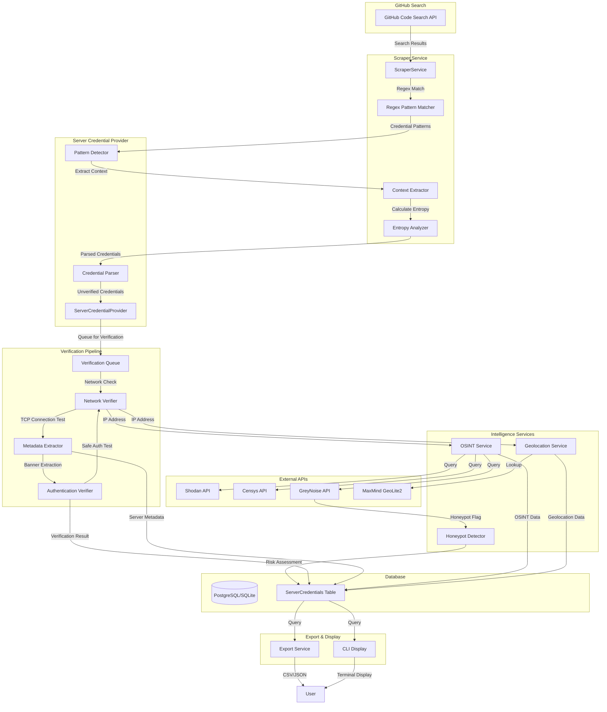
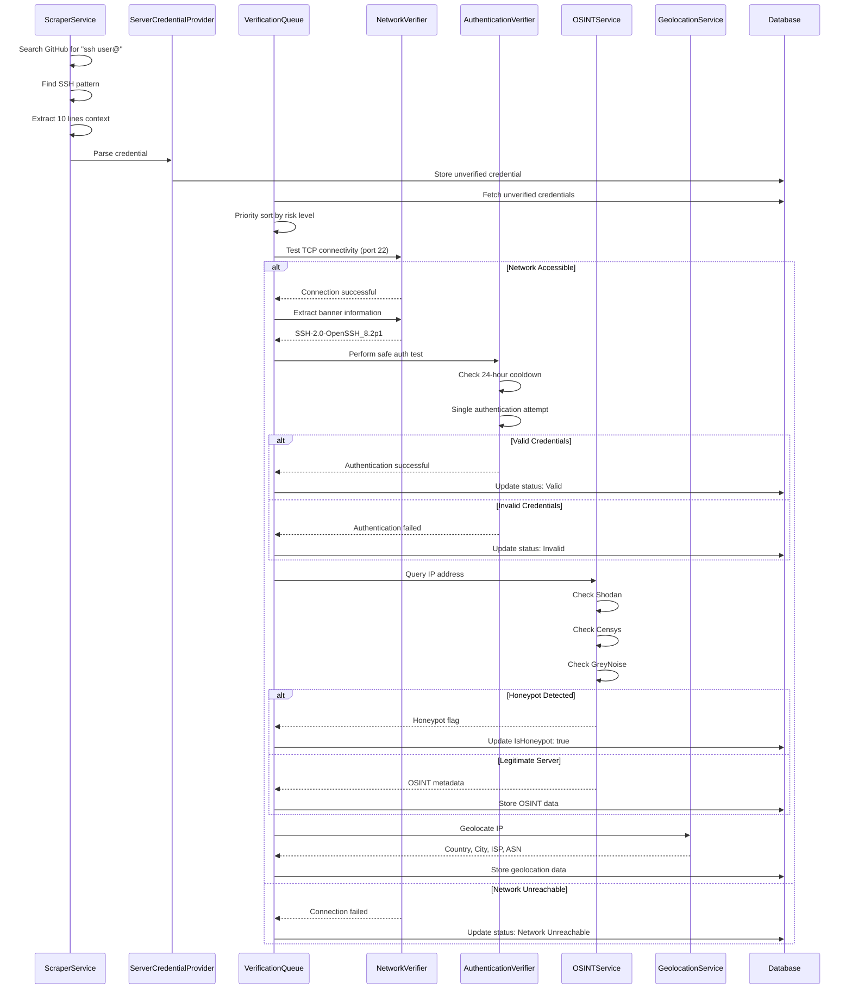

# Design Document: Server and Credential Detection

## Overview

This design document specifies the technical implementation for adding server credential detection, verification, and metadata extraction to the UnsecuredAPIKeys tool. The feature expands beyond API keys to detect SSH, FTP/SFTP, RDP, VNC, WinRM, SMTP, IMAP, POP3, cPanel, WHM, Plesk, web server, database, cloud, and container credentials exposed in GitHub repositories. It includes multi-stage verification with network connectivity checks, safe authentication testing, OSINT integration (Shodan, Censys, GreyNoise), geolocation analysis, and advanced search techniques. The implementation is optimized for Render free tier deployment with memory-efficient processing and flexible Direct I/O strategy.

### Goals

1. **Detect server credentials** exposed in GitHub repositories using regex patterns for 14+ credential types
2. **Verify network connectivity** using TCP connection tests on appropriate ports
3. **Perform safe authentication testing** with single-attempt verification and 24-hour cooldowns
4. **Extract server metadata** including banners, versions, OS fingerprinting, and SSL/TLS certificates
5. **Integrate OSINT services** (Shodan, Censys, GreyNoise) for enhanced intelligence and honeypot detection
6. **Perform geolocation analysis** to identify country, city, ISP, ASN, and cloud provider IP ranges
7. **Implement advanced search** including terminal history, source maps, SQL dumps, and entropy analysis
8. **Optimize for Render free tier** with memory limits, concurrent operation limits, and flexible I/O strategy
9. **Store server credential metadata** in database with 15+ new columns
10. **Export and display** server credential data in CSV/JSON formats and CLI interface

### Non-Goals

- Automated credential exploitation or unauthorized access
- Continuous monitoring or real-time alerting
- Credential revocation or remediation
- Deep packet inspection or traffic analysis
- Vulnerability scanning beyond banner analysis


## Architecture

### High-Level Component Diagram



### Component Interaction Flow




## Components and Interfaces

### 1. ServerCredentialProvider Class

The `ServerCredentialProvider` class inherits from `BaseApiKeyProvider` and implements server credential detection logic for 14+ credential types.

#### Class Structure

```csharp
namespace UnsecuredAPIKeys.Providers.Server_Providers
{
    [ApiProvider]
    public class ServerCredentialProvider : BaseApiKeyProvider
    {
        // Provider identification
        public override string ProviderName => "Server Credentials";
        public override ApiTypeEnum ApiType => ApiTypeEnum.ServerCredential;
        
        // Regex patterns for detection
        public override IEnumerable<string> RegexPatterns { get; }
        
        // Services
        private readonly INetworkVerifier _networkVerifier;
        private readonly IAuthenticationVerifier _authVerifier;
        private readonly IContextExtractor _contextExtractor;
        private readonly IEntropyAnalyzer _entropyAnalyzer;
        private readonly ILogger<ServerCredentialProvider>? _logger;
        
        // Constructors
        public ServerCredentialProvider(
            INetworkVerifier networkVerifier,
            IAuthenticationVerifier authVerifier,
            IContextExtractor contextExtractor,
            IEntropyAnalyzer entropyAnalyzer,
            ILogger<ServerCredentialProvider>? logger = null);
        
        // Core validation method
        protected override Task<ValidationResult> ValidateKeyWithHttpClientAsync(
            string apiKey, HttpClient httpClient);
        
        // Credential parsing methods
        private ServerCredential ParseSSHCredential(string pattern, string context);
        private ServerCredential ParseFTPCredential(string pattern, string context);
        private ServerCredential ParseDatabaseCredential(string pattern, string context);
        private ServerCredential ParseRDPCredential(string pattern, string context);
        private ServerCredential ParseSMTPCredential(string pattern, string context);
        private ServerCredential ParseControlPanelCredential(string pattern, string context);
        private ServerCredential ParseCloudCredential(string pattern, string context);
        
        // Helper methods
        private CredentialType DetermineCredentialType(string pattern);
        private int GetDefaultPort(CredentialType type);
    }
}
```

#### Regex Patterns

The provider uses comprehensive regex patterns to detect various credential types:

```csharp
public override IEnumerable<string> RegexPatterns =>
[
    // SSH Credentials
    @"ssh\s+([a-zA-Z0-9_-]+)@([a-zA-Z0-9.-]+)",
    @"-----BEGIN\s+(RSA|DSA|EC|OPENSSH)\s+PRIVATE\s+KEY-----",
    @"Host\s+([a-zA-Z0-9.-]+)\s+User\s+([a-zA-Z0-9_-]+)",
    
    // FTP/SFTP Credentials
    @"(ftp|sftp|ftps)://([a-zA-Z0-9_-]+):([^@\s]+)@([a-zA-Z0-9.-]+)(?::(\d+))?",
    @"FTP_HOST\s*=\s*['""]?([a-zA-Z0-9.-]+)['""]?",
    @"FTP_USER\s*=\s*['""]?([a-zA-Z0-9_-]+)['""]?",
    @"FTP_PASS\s*=\s*['""]?([^\s'""\n]+)['""]?",
    
    // Database Connection Strings
    @"mysql://([a-zA-Z0-9_-]+):([^@\s]+)@([a-zA-Z0-9.-]+)(?::(\d+))?/([a-zA-Z0-9_-]+)",
    @"postgresql://([a-zA-Z0-9_-]+):([^@\s]+)@([a-zA-Z0-9.-]+)(?::(\d+))?/([a-zA-Z0-9_-]+)",
    @"mongodb://([a-zA-Z0-9_-]+):([^@\s]+)@([a-zA-Z0-9.-]+)(?::(\d+))?/([a-zA-Z0-9_-]+)",
    @"redis://(?::([^@\s]+)@)?([a-zA-Z0-9.-]+)(?::(\d+))?",
    @"Server=([a-zA-Z0-9.-]+);Database=([a-zA-Z0-9_-]+);User Id=([a-zA-Z0-9_-]+);Password=([^;]+);",
    @"jdbc:(mysql|postgresql|sqlserver)://([a-zA-Z0-9.-]+)(?::(\d+))?/([a-zA-Z0-9_-]+)",
    
    // RDP and Remote Access
    @"rdp://([a-zA-Z0-9_-]+):([^@\s]+)@([a-zA-Z0-9.-]+)(?::(\d+))?",
    @"mstsc\s+/v:([a-zA-Z0-9.-]+)(?::(\d+))?",
    @"vnc://([a-zA-Z0-9_-]+):([^@\s]+)@([a-zA-Z0-9.-]+)(?::(\d+))?",
    @"TeamViewer\s+ID:\s*(\d+)\s+Password:\s*([a-zA-Z0-9]+)",
    @"WinRM\s+([a-zA-Z0-9.-]+)\s+([a-zA-Z0-9_-]+)\s+([^\s]+)",
    
    // SMTP and Email Servers
    @"smtp://([a-zA-Z0-9_-]+):([^@\s]+)@([a-zA-Z0-9.-]+)(?::(\d+))?",
    @"SMTP_HOST\s*=\s*['""]?([a-zA-Z0-9.-]+)['""]?",
    @"SMTP_USER\s*=\s*['""]?([a-zA-Z0-9_@.-]+)['""]?",
    @"SMTP_PASSWORD\s*=\s*['""]?([^\s'""\n]+)['""]?",
    @"SMTP_PORT\s*=\s*['""]?(\d+)['""]?",
    @"imap://([a-zA-Z0-9_-]+):([^@\s]+)@([a-zA-Z0-9.-]+)(?::(\d+))?",
    @"pop3://([a-zA-Z0-9_-]+):([^@\s]+)@([a-zA-Z0-9.-]+)(?::(\d+))?",
    
    // cPanel and Control Panels
    @"CPANEL_USER\s*=\s*['""]?([a-zA-Z0-9_-]+)['""]?",
    @"CPANEL_PASS\s*=\s*['""]?([^\s'""\n]+)['""]?",
    @"WHM_USER\s*=\s*['""]?([a-zA-Z0-9_-]+)['""]?",
    @"WHM_PASS\s*=\s*['""]?([^\s'""\n]+)['""]?",
    @"PLESK_USER\s*=\s*['""]?([a-zA-Z0-9_-]+)['""]?",
    @"PLESK_PASS\s*=\s*['""]?([^\s'""\n]+)['""]?",
    
    // Cloud and Container
    @"KUBERNETES_SERVICE_HOST\s*=\s*['""]?([a-zA-Z0-9.-]+)['""]?",
    @"DOCKER_HOST\s*=\s*tcp://([a-zA-Z0-9.-]+):(\d+)",
    @"kubeconfig",
    
    // Web Server Authentication
    @"AuthUserFile\s+([^\s]+)",
    @"htpasswd\s+([^\s]+)",
    @"<user\s+username=['""]([^'""\s]+)['""].*password=['""]([^'""\s]+)['""]",
];
```

### 2. Context Extractor Service

The `ContextExtractor` searches surrounding code for related credential components.

#### Interface

```csharp
public interface IContextExtractor
{
    Task<CredentialContext> ExtractContextAsync(
        string fileContent,
        int matchPosition,
        int contextLines = 10);
    
    string FindRelatedPassword(string context, string username);
    string FindRelatedHost(string context);
    int FindRelatedPort(string context, CredentialType type);
}
```

#### Implementation

```csharp
public class ContextExtractor : IContextExtractor
{
    private readonly ILogger<ContextExtractor>? _logger;
    
    public async Task<CredentialContext> ExtractContextAsync(
        string fileContent,
        int matchPosition,
        int contextLines = 10)
    {
        var lines = fileContent.Split('\n');
        var matchLine = GetLineNumber(fileContent, matchPosition);
        
        var startLine = Math.Max(0, matchLine - contextLines);
        var endLine = Math.Min(lines.Length - 1, matchLine + contextLines);
        
        var contextText = string.Join("\n", 
            lines.Skip(startLine).Take(endLine - startLine + 1));
        
        return new CredentialContext
        {
            FullContext = contextText,
            MatchLine = matchLine,
            StartLine = startLine,
            EndLine = endLine
        };
    }
    
    public string FindRelatedPassword(string context, string username)
    {
        // Search for password patterns near username
        var patterns = new[]
        {
            $@"{username}['""]?\s*[:=]\s*['""]?([^\s'""\n]+)",
            @"password\s*[:=]\s*['""]?([^\s'""\n]+)['""]?",
            @"pass\s*[:=]\s*['""]?([^\s'""\n]+)['""]?",
            @"pwd\s*[:=]\s*['""]?([^\s'""\n]+)['""]?",
        };
        
        foreach (var pattern in patterns)
        {
            var match = Regex.Match(context, pattern, RegexOptions.IgnoreCase);
            if (match.Success)
            {
                return match.Groups[1].Value;
            }
        }
        
        return string.Empty;
    }
    
    public string FindRelatedHost(string context)
    {
        var patterns = new[]
        {
            @"host\s*[:=]\s*['""]?([a-zA-Z0-9.-]+)['""]?",
            @"server\s*[:=]\s*['""]?([a-zA-Z0-9.-]+)['""]?",
            @"hostname\s*[:=]\s*['""]?([a-zA-Z0-9.-]+)['""]?",
            @"(\d{1,3}\.\d{1,3}\.\d{1,3}\.\d{1,3})",
        };
        
        foreach (var pattern in patterns)
        {
            var match = Regex.Match(context, pattern, RegexOptions.IgnoreCase);
            if (match.Success)
            {
                return match.Groups[1].Value;
            }
        }
        
        return string.Empty;
    }
    
    public int FindRelatedPort(string context, CredentialType type)
    {
        var portPattern = @"port\s*[:=]\s*['""]?(\d+)['""]?";
        var match = Regex.Match(context, portPattern, RegexOptions.IgnoreCase);
        
        if (match.Success && int.TryParse(match.Groups[1].Value, out var port))
        {
            return port;
        }
        
        // Return default port for credential type
        return GetDefaultPort(type);
    }
    
    private int GetLineNumber(string content, int position)
    {
        return content.Substring(0, position).Count(c => c == '\n');
    }
    
    private int GetDefaultPort(CredentialType type)
    {
        return type switch
        {
            CredentialType.SSH => 22,
            CredentialType.FTP => 21,
            CredentialType.SFTP => 22,
            CredentialType.RDP => 3389,
            CredentialType.VNC => 5900,
            CredentialType.WinRM_HTTP => 5985,
            CredentialType.WinRM_HTTPS => 5986,
            CredentialType.SMTP => 25,
            CredentialType.SMTP_Submission => 587,
            CredentialType.SMTPS => 465,
            CredentialType.IMAP => 143,
            CredentialType.IMAPS => 993,
            CredentialType.POP3 => 110,
            CredentialType.POP3S => 995,
            CredentialType.MySQL => 3306,
            CredentialType.PostgreSQL => 5432,
            CredentialType.MongoDB => 27017,
            CredentialType.Redis => 6379,
            CredentialType.cPanel_HTTP => 2082,
            CredentialType.cPanel_HTTPS => 2083,
            CredentialType.WHM_HTTP => 2086,
            CredentialType.WHM_HTTPS => 2087,
            CredentialType.Plesk => 8443,
            _ => 0
        };
    }
}
```

### 3. Entropy Analyzer Service

The `EntropyAnalyzer` calculates Shannon entropy to identify high-randomness passwords.

#### Interface

```csharp
public interface IEntropyAnalyzer
{
    double CalculateEntropy(string input);
    bool IsHighEntropyPassword(string input, double threshold = 4.0);
}
```

#### Implementation

```csharp
public class EntropyAnalyzer : IEntropyAnalyzer
{
    public double CalculateEntropy(string input)
    {
        if (string.IsNullOrEmpty(input))
            return 0.0;
        
        var frequency = new Dictionary<char, int>();
        foreach (var c in input)
        {
            if (frequency.ContainsKey(c))
                frequency[c]++;
            else
                frequency[c] = 1;
        }
        
        double entropy = 0.0;
        var length = input.Length;
        
        foreach (var count in frequency.Values)
        {
            var probability = (double)count / length;
            entropy -= probability * Math.Log2(probability);
        }
        
        return entropy;
    }
    
    public bool IsHighEntropyPassword(string input, double threshold = 4.0)
    {
        return CalculateEntropy(input) >= threshold;
    }
}
```

### 4. Network Verifier Service

The `NetworkVerifier` performs TCP connectivity tests and banner extraction.

#### Interface

```csharp
public interface INetworkVerifier
{
    Task<NetworkVerificationResult> VerifyConnectivityAsync(
        string host,
        int port,
        int timeoutSeconds = 10);
    
    Task<string> ExtractBannerAsync(
        string host,
        int port,
        int timeoutSeconds = 10);
    
    Task<string> PerformOSFingerprintingAsync(string host);
    Task<SslCertificateInfo> ExtractSslCertificateAsync(string host, int port);
}
```

#### Implementation

```csharp
public class NetworkVerifier : INetworkVerifier
{
    private readonly ILogger<NetworkVerifier>? _logger;
    
    public async Task<NetworkVerificationResult> VerifyConnectivityAsync(
        string host,
        int port,
        int timeoutSeconds = 10)
    {
        try
        {
            using var client = new TcpClient();
            var connectTask = client.ConnectAsync(host, port);
            var timeoutTask = Task.Delay(TimeSpan.FromSeconds(timeoutSeconds));
            
            var completedTask = await Task.WhenAny(connectTask, timeoutTask);
            
            if (completedTask == timeoutTask)
            {
                return NetworkVerificationResult.Timeout();
            }
            
            if (client.Connected)
            {
                return NetworkVerificationResult.Success(host, port);
            }
            
            return NetworkVerificationResult.Unreachable();
        }
        catch (SocketException ex)
        {
            _logger?.LogDebug("Socket error for {Host}:{Port} - {Error}", 
                host, port, ex.Message);
            return NetworkVerificationResult.Unreachable();
        }
        catch (Exception ex)
        {
            _logger?.LogError(ex, "Network verification error for {Host}:{Port}", 
                host, port);
            return NetworkVerificationResult.Error(ex.Message);
        }
    }
    
    public async Task<string> ExtractBannerAsync(
        string host,
        int port,
        int timeoutSeconds = 10)
    {
        try
        {
            using var client = new TcpClient();
            await client.ConnectAsync(host, port);
            
            using var stream = client.GetStream();
            stream.ReadTimeout = timeoutSeconds * 1000;
            
            var buffer = new byte[1024];
            var bytesRead = await stream.ReadAsync(buffer, 0, buffer.Length);
            
            if (bytesRead > 0)
            {
                return Encoding.UTF8.GetString(buffer, 0, bytesRead).Trim();
            }
            
            return "No banner received";
        }
        catch (Exception ex)
        {
            _logger?.LogDebug("Banner extraction failed for {Host}:{Port} - {Error}", 
                host, port, ex.Message);
            return "Banner extraction failed";
        }
    }
    
    public async Task<SslCertificateInfo> ExtractSslCertificateAsync(
        string host,
        int port)
    {
        try
        {
            using var client = new TcpClient();
            await client.ConnectAsync(host, port);
            
            using var sslStream = new SslStream(
                client.GetStream(),
                false,
                (sender, certificate, chain, errors) => true);
            
            await sslStream.AuthenticateAsClientAsync(host);
            
            var cert = sslStream.RemoteCertificate as X509Certificate2;
            if (cert != null)
            {
                return new SslCertificateInfo
                {
                    Subject = cert.Subject,
                    Issuer = cert.Issuer,
                    ValidFrom = cert.NotBefore,
                    ValidTo = cert.NotAfter,
                    Thumbprint = cert.Thumbprint
                };
            }
            
            return SslCertificateInfo.NotAvailable();
        }
        catch (Exception ex)
        {
            _logger?.LogDebug("SSL certificate extraction failed for {Host}:{Port} - {Error}", 
                host, port, ex.Message);
            return SslCertificateInfo.Error(ex.Message);
        }
    }
}
```


### 5. Authentication Verifier Service

The `AuthenticationVerifier` performs safe single-attempt authentication tests with 24-hour cooldowns.

#### Interface

```csharp
public interface IAuthenticationVerifier
{
    Task<AuthVerificationResult> VerifySSHAsync(string host, int port, string username, string password);
    Task<AuthVerificationResult> VerifyFTPAsync(string host, int port, string username, string password);
    Task<AuthVerificationResult> VerifyRDPAsync(string host, int port, string username, string password, string domain = "");
    Task<AuthVerificationResult> VerifySMTPAsync(string host, int port, string username, string password);
    Task<AuthVerificationResult> VerifyIMAPAsync(string host, int port, string username, string password);
    Task<AuthVerificationResult> VerifyPOP3Async(string host, int port, string username, string password);
    Task<AuthVerificationResult> VerifyCPanelAsync(string host, int port, string username, string password);
    Task<AuthVerificationResult> VerifyWHMAsync(string host, int port, string username, string password);
    Task<AuthVerificationResult> VerifyPleskAsync(string host, int port, string username, string password);
    Task<AuthVerificationResult> VerifyDatabaseAsync(CredentialType dbType, string host, int port, string username, string password, string database);
    bool IsOnCooldown(string credentialHash);
}
```

#### Cooldown Logic

```csharp
public class AuthenticationVerifier : IAuthenticationVerifier
{
    private readonly IMemoryCache _cooldownCache;
    private readonly TimeSpan _cooldownPeriod = TimeSpan.FromHours(24);

    public bool IsOnCooldown(string credentialHash)
    {
        return _cooldownCache.TryGetValue($"auth_cooldown_{credentialHash}", out _);
    }

    private void SetCooldown(string credentialHash)
    {
        _cooldownCache.Set($"auth_cooldown_{credentialHash}", true, _cooldownPeriod);
    }

    public async Task<AuthVerificationResult> VerifyCPanelAsync(
        string host, int port, string username, string password)
    {
        var hash = ComputeHash(host, port, username);
        if (IsOnCooldown(hash))
            return AuthVerificationResult.RateLimited();

        try
        {
            // Use cPanel UAPI/JSON-API for safe auth check
            using var client = new HttpClient();
            client.Timeout = TimeSpan.FromSeconds(10);
            var url = $"https://{host}:{port}/execute/Email/list_pops";
            client.DefaultRequestHeaders.Authorization =
                new AuthenticationHeaderValue("Basic",
                    Convert.ToBase64String(Encoding.UTF8.GetBytes($"{username}:{password}")));

            var response = await client.GetAsync(url);
            SetCooldown(hash);

            return response.IsSuccessStatusCode
                ? AuthVerificationResult.Valid("cPanel authentication successful")
                : AuthVerificationResult.Invalid("cPanel authentication failed");
        }
        catch (Exception ex)
        {
            return AuthVerificationResult.Error(ex.Message);
        }
    }

    public async Task<AuthVerificationResult> VerifyWHMAsync(
        string host, int port, string username, string password)
    {
        var hash = ComputeHash(host, port, username);
        if (IsOnCooldown(hash))
            return AuthVerificationResult.RateLimited();

        try
        {
            using var client = new HttpClient();
            client.Timeout = TimeSpan.FromSeconds(10);
            var url = $"https://{host}:{port}/json-api/version";
            client.DefaultRequestHeaders.Authorization =
                new AuthenticationHeaderValue("Basic",
                    Convert.ToBase64String(Encoding.UTF8.GetBytes($"{username}:{password}")));

            var response = await client.GetAsync(url);
            SetCooldown(hash);

            return response.IsSuccessStatusCode
                ? AuthVerificationResult.Valid("WHM authentication successful")
                : AuthVerificationResult.Invalid("WHM authentication failed");
        }
        catch (Exception ex)
        {
            return AuthVerificationResult.Error(ex.Message);
        }
    }

    private string ComputeHash(string host, int port, string username)
    {
        var input = $"{host}:{port}:{username}";
        using var sha = SHA256.Create();
        return Convert.ToHexString(sha.ComputeHash(Encoding.UTF8.GetBytes(input)));
    }
}
```

### 6. OSINT Service

The `OSINTService` integrates with Shodan, Censys, and GreyNoise for enhanced intelligence.

#### Interface

```csharp
public interface IOSINTService
{
    Task<OSINTResult> QueryShodanAsync(string ipAddress);
    Task<OSINTResult> QueryCensysAsync(string ipAddress);
    Task<GreyNoiseResult> QueryGreyNoiseAsync(string ipAddress);
    Task<bool> IsHoneypotAsync(string ipAddress);
}
```

#### Rate-Limited Implementation

```csharp
public class OSINTService : IOSINTService
{
    private readonly SemaphoreSlim _rateLimiter = new(1, 1);
    private readonly TimeSpan _requestDelay = TimeSpan.FromSeconds(5);
    private readonly IMemoryCache _cache;

    public async Task<GreyNoiseResult> QueryGreyNoiseAsync(string ipAddress)
    {
        var cacheKey = $"greynoise_{ipAddress}";
        if (_cache.TryGetValue(cacheKey, out GreyNoiseResult cached))
            return cached;

        await _rateLimiter.WaitAsync();
        try
        {
            await Task.Delay(_requestDelay);
            // HTTP call to api.greynoise.io/v3/community/{ip}
            var result = await FetchGreyNoiseAsync(ipAddress);
            _cache.Set(cacheKey, result, TimeSpan.FromHours(24));
            return result;
        }
        finally
        {
            _rateLimiter.Release();
        }
    }

    public async Task<bool> IsHoneypotAsync(string ipAddress)
    {
        var result = await QueryGreyNoiseAsync(ipAddress);
        return result?.Classification == "malicious" || result?.IsBot == true;
    }
}
```

### 7. Geolocation Service

The `GeolocationService` uses MaxMind GeoLite2 for offline IP geolocation.

#### Interface

```csharp
public interface IGeolocationService
{
    Task<GeolocationResult> GeolocateAsync(string ipAddress);
    bool IsCloudProviderIP(string ipAddress, out string providerName);
}
```

#### Cloud Provider IP Range Detection

```csharp
public class GeolocationService : IGeolocationService
{
    // Cloud provider CIDR ranges loaded at startup
    private readonly Dictionary<string, List<IPNetwork>> _cloudRanges = new()
    {
        ["AWS"]          = LoadCidrs("aws-ip-ranges.json"),
        ["Azure"]        = LoadCidrs("azure-ip-ranges.json"),
        ["GCP"]          = LoadCidrs("gcp-ip-ranges.json"),
        ["DigitalOcean"] = LoadCidrs("do-ip-ranges.json"),
        ["Linode"]       = LoadCidrs("linode-ip-ranges.json"),
        ["Vultr"]        = LoadCidrs("vultr-ip-ranges.json"),
        ["Hetzner"]      = LoadCidrs("hetzner-ip-ranges.json"),
        ["OracleCloud"]  = LoadCidrs("oracle-ip-ranges.json"),
    };

    public bool IsCloudProviderIP(string ipAddress, out string providerName)
    {
        var ip = IPAddress.Parse(ipAddress);
        foreach (var (provider, ranges) in _cloudRanges)
        {
            if (ranges.Any(r => r.Contains(ip)))
            {
                providerName = provider;
                return true;
            }
        }
        providerName = string.Empty;
        return false;
    }
}
```

### 8. Adaptive I/O Manager

The `AdaptiveIOManager` benchmarks Direct I/O vs streaming on startup and selects the best strategy for the current platform.

```csharp
public class AdaptiveIOManager
{
    private IOStrategy _selectedStrategy;

    public enum IOStrategy { DirectIO, Streaming }

    public async Task InitializeAsync()
    {
        _selectedStrategy = await BenchmarkAndSelectAsync();
    }

    private async Task<IOStrategy> BenchmarkAndSelectAsync()
    {
        // Write a 1MB temp file and measure read throughput for both strategies
        var tempFile = Path.GetTempFileName();
        await File.WriteAllBytesAsync(tempFile, new byte[1_048_576]);

        var directMs  = await MeasureDirectIOAsync(tempFile);
        var streamMs  = await MeasureStreamingAsync(tempFile);

        File.Delete(tempFile);

        // Use Direct I/O only if it is at least 20% faster
        return directMs * 1.2 < streamMs ? IOStrategy.DirectIO : IOStrategy.Streaming;
    }

    public async Task<string> ReadFileAsync(string path, int maxSizeBytes = 10_485_760)
    {
        var info = new FileInfo(path);
        if (info.Length > maxSizeBytes)
            return await ReadStreamingAsync(path);   // always stream oversized files

        return _selectedStrategy == IOStrategy.DirectIO
            ? await ReadDirectIOAsync(path)
            : await ReadStreamingAsync(path);
    }

    private async Task<string> ReadStreamingAsync(string path)
    {
        using var reader = new StreamReader(path, bufferSize: 32_768);
        return await reader.ReadToEndAsync();
    }

    private async Task<string> ReadDirectIOAsync(string path)
    {
        // FileOptions.WriteThrough bypasses OS write cache (closest to Direct I/O on .NET)
        using var fs = new FileStream(path, FileMode.Open, FileAccess.Read,
            FileShare.Read, 32_768, FileOptions.SequentialScan);
        using var reader = new StreamReader(fs);
        return await reader.ReadToEndAsync();
    }
}
```

### 9. Render Optimizer

The `RenderOptimizer` enforces concurrency limits and memory thresholds for Render free tier.

```csharp
public class RenderOptimizer
{
    private readonly bool _isRenderFreeTier;
    public int MaxConcurrentScans      => _isRenderFreeTier ? 2  : 10;
    public int MaxConcurrentVerify     => _isRenderFreeTier ? 1  : 5;
    public int VerificationBatchSize   => _isRenderFreeTier ? 10 : 50;
    public int MaxFileSizeBytes        => _isRenderFreeTier ? 10_485_760 : 104_857_600;
    public int MaxFilesPerScan         => _isRenderFreeTier ? 100 : 1000;
    public int BufferSizeBytes         => _isRenderFreeTier ? 32_768 : 65_536;
    public long MemoryThresholdBytes   => 400L * 1024 * 1024;   // 400 MB

    public async Task CheckMemoryPressureAsync()
    {
        var used = GC.GetTotalMemory(false);
        if (used > MemoryThresholdBytes)
        {
            GC.Collect(2, GCCollectionMode.Aggressive, blocking: true, compacting: true);
            await Task.Delay(500);
        }
    }
}
```

### 10. Verification Queue

```csharp
public class VerificationQueue
{
    private readonly PriorityQueue<ServerCredential, int> _queue = new();
    private readonly SemaphoreSlim _lock = new(1, 1);
    private const int MaxQueueSize = 1000;

    // Priority: Critical=0, High=1, Medium=2, Low=3
    public async Task EnqueueAsync(ServerCredential credential)
    {
        await _lock.WaitAsync();
        try
        {
            if (_queue.Count >= MaxQueueSize) return;
            _queue.Enqueue(credential, (int)credential.RiskLevel);
        }
        finally { _lock.Release(); }
    }

    public async Task<ServerCredential?> DequeueAsync()
    {
        await _lock.WaitAsync();
        try
        {
            return _queue.TryDequeue(out var item, out _) ? item : null;
        }
        finally { _lock.Release(); }
    }
}
```

---

## Data Models

### ServerCredential Model

```csharp
public class ServerCredential
{
    public int    Id                   { get; set; }
    public string CredentialType       { get; set; } = string.Empty;  // SSH, FTP, RDP, SMTP, cPanel, WHM …
    public string Host                 { get; set; } = string.Empty;
    public int    Port                 { get; set; }
    public string Username             { get; set; } = string.Empty;
    public string PasswordHash         { get; set; } = string.Empty;  // SHA-256, never plaintext
    public string Domain               { get; set; } = string.Empty;  // for RDP/WinRM
    public string NetworkStatus        { get; set; } = "Unknown";     // Accessible | Unreachable | Timeout
    public string AuthenticationStatus { get; set; } = "Untested";   // Valid | Invalid | RateLimited | Error
    public string ServerMetadata       { get; set; } = "{}";          // JSON: banner, version, OS, SSL
    public string GeolocationData      { get; set; } = "{}";          // JSON: country, city, ISP, ASN, cloud
    public string OSINTData            { get; set; } = "{}";          // JSON: Shodan, Censys, GreyNoise
    public string RiskLevel            { get; set; } = "Low";         // Critical | High | Medium | Low
    public bool   IsHoneypot           { get; set; }
    public string SourceRepository     { get; set; } = string.Empty;
    public string SourceFilePath       { get; set; } = string.Empty;
    public string SurroundingContext   { get; set; } = string.Empty;
    public double EntropyScore         { get; set; }
    public DateTime DiscoveredAt       { get; set; } = DateTime.UtcNow;
    public DateTime? LastVerifiedAt    { get; set; }
}
```

### Database Schema

```sql
CREATE TABLE ServerCredentials (
    Id                   SERIAL PRIMARY KEY,
    CredentialType       VARCHAR(50)  NOT NULL,
    Host                 VARCHAR(255) NOT NULL,
    Port                 INTEGER      NOT NULL DEFAULT 0,
    Username             VARCHAR(255),
    PasswordHash         VARCHAR(64),
    Domain               VARCHAR(255),
    NetworkStatus        VARCHAR(50)  NOT NULL DEFAULT 'Unknown',
    AuthenticationStatus VARCHAR(50)  NOT NULL DEFAULT 'Untested',
    ServerMetadata       JSONB        NOT NULL DEFAULT '{}',
    GeolocationData      JSONB        NOT NULL DEFAULT '{}',
    OSINTData            JSONB        NOT NULL DEFAULT '{}',
    RiskLevel            VARCHAR(20)  NOT NULL DEFAULT 'Low',
    IsHoneypot           BOOLEAN      NOT NULL DEFAULT FALSE,
    SourceRepository     VARCHAR(500),
    SourceFilePath       VARCHAR(500),
    SurroundingContext   TEXT,
    EntropyScore         DOUBLE PRECISION DEFAULT 0,
    DiscoveredAt         TIMESTAMPTZ  NOT NULL DEFAULT NOW(),
    LastVerifiedAt       TIMESTAMPTZ,
    CONSTRAINT uq_server_cred UNIQUE (Host, Port, Username, CredentialType)
);

CREATE INDEX idx_sc_type        ON ServerCredentials (CredentialType);
CREATE INDEX idx_sc_risk        ON ServerCredentials (RiskLevel);
CREATE INDEX idx_sc_auth_status ON ServerCredentials (AuthenticationStatus);
CREATE INDEX idx_sc_honeypot    ON ServerCredentials (IsHoneypot);
```

### Supporting Value Objects

```csharp
public record NetworkVerificationResult(
    bool IsAccessible, string Status, string? ErrorMessage = null)
{
    public static NetworkVerificationResult Success(string host, int port) =>
        new(true, "Accessible");
    public static NetworkVerificationResult Unreachable() =>
        new(false, "Unreachable");
    public static NetworkVerificationResult Timeout() =>
        new(false, "Timeout");
    public static NetworkVerificationResult Error(string msg) =>
        new(false, "Error", msg);
}

public record AuthVerificationResult(
    bool IsValid, string Status, string? Details = null)
{
    public static AuthVerificationResult Valid(string details)    => new(true,  "Valid",       details);
    public static AuthVerificationResult Invalid(string details)  => new(false, "Invalid",     details);
    public static AuthVerificationResult RateLimited()            => new(false, "RateLimited");
    public static AuthVerificationResult Error(string msg)        => new(false, "Error",       msg);
}

public record SslCertificateInfo(
    string Subject, string Issuer,
    DateTime ValidFrom, DateTime ValidTo, string Thumbprint)
{
    public static SslCertificateInfo NotAvailable() =>
        new("N/A", "N/A", DateTime.MinValue, DateTime.MinValue, "N/A");
    public static SslCertificateInfo Error(string msg) =>
        new(msg, msg, DateTime.MinValue, DateTime.MinValue, msg);
}

public enum RiskLevel { Critical = 0, High = 1, Medium = 2, Low = 3 }
```

---

## Correctness Properties

These properties are encoded as executable property-based tests using FsCheck or a similar PBT framework.

### P1 — Pattern Completeness
**For every supported credential type, the regex patterns must match at least one canonical example.**
```
∀ type ∈ {SSH, FTP, RDP, VNC, WinRM, SMTP, IMAP, POP3, cPanel, WHM, Plesk, MySQL, PostgreSQL, MongoDB, Redis, MSSQL, Kubernetes, Docker}
  ∃ pattern ∈ RegexPatterns : pattern.IsMatch(CanonicalExample(type))
```

### P2 — No Plaintext Password Storage
**Passwords extracted from credentials must never be stored in plaintext; only their SHA-256 hash is persisted.**
```
∀ credential ∈ StoredCredentials :
  credential.PasswordHash = SHA256(rawPassword)  ∧  rawPassword ∉ Database
```

### P3 — Single Authentication Attempt Per Credential Per Day
**The authentication verifier must not attempt more than one login per (host, port, username) tuple within any 24-hour window.**
```
∀ (host, port, username), ∀ t₁, t₂ ∈ AuthAttempts(host, port, username) :
  |t₁ − t₂| ≥ 24h
```

### P4 — Network Timeout Enforcement
**Every TCP connectivity test must complete within the configured timeout (default 10 s).**
```
∀ verificationCall : Duration(verificationCall) ≤ TimeoutSeconds + ε
```

### P5 — Honeypot Propagation
**If GreyNoise flags an IP as a honeypot, the corresponding credential record must have IsHoneypot = true.**
```
∀ ip : GreyNoise.IsHoneypot(ip) = true ⟹
  ∀ cred ∈ Credentials where cred.Host = ip : cred.IsHoneypot = true
```

### P6 — Render Free Tier Concurrency Invariant
**When running on Render free tier, active concurrent scans must never exceed 2 and active verifications must never exceed 1.**
```
∀ t : ActiveScans(t) ≤ 2  ∧  ActiveVerifications(t) ≤ 1   (when isRenderFreeTier = true)
```

### P7 — Entropy Score Accuracy
**Shannon entropy calculated for a string must satisfy the mathematical definition within floating-point tolerance.**
```
∀ s : |EntropyAnalyzer.Calculate(s) − ShannonEntropy(s)| < 1e-9
```

### P8 — OSINT Cache Freshness
**OSINT results must not be served from cache if the cached entry is older than 24 hours.**
```
∀ ip, ∀ cachedResult : Age(cachedResult) > 24h ⟹ FetchFresh(ip)
```

---

## Error Handling

| Scenario | Behaviour |
|---|---|
| TCP connection timeout | Mark `NetworkStatus = "Timeout"`, continue queue |
| Connection refused | Mark `NetworkStatus = "Unreachable"`, continue queue |
| Auth attempt triggers lockout warning | Immediately stop, mark `AuthenticationStatus = "LockoutRisk"`, activate circuit breaker for host |
| SSL/TLS certificate error | Log warning, attempt insecure fallback, mark `ServerMetadata.sslError` |
| OSINT API unavailable | Log warning, skip OSINT enrichment, continue processing |
| Geolocation lookup failure | Store `"Geolocation unavailable"`, continue processing |
| Memory > 400 MB | Pause queue, force GC, resume after memory drops below threshold |
| Queue > 1000 items | Pause new enqueues, drain existing items first |
| 50% verification failure rate | Pause all verification, emit alert, wait for operator action |
| Pattern compilation OOM | Fall back to non-compiled `Regex` instances |

### Circuit Breaker

```csharp
public class HostCircuitBreaker
{
    private readonly Dictionary<string, CircuitState> _states = new();
    private const int FailureThreshold = 3;

    public bool IsOpen(string host) =>
        _states.TryGetValue(host, out var s) && s.IsOpen;

    public void RecordFailure(string host)
    {
        var state = _states.GetOrAdd(host, _ => new CircuitState());
        state.Failures++;
        if (state.Failures >= FailureThreshold)
            state.OpenUntil = DateTime.UtcNow.AddMinutes(30);
    }
}
```

---

## Testing Strategy

### Unit Tests

| Component | Test Focus |
|---|---|
| `ServerCredentialProvider` | Each regex pattern matches its canonical example and does not match unrelated strings |
| `ContextExtractor` | Correctly extracts ±10 lines; finds password/host/port in surrounding context |
| `EntropyAnalyzer` | Known strings produce expected entropy values; threshold classification is correct |
| `NetworkVerifier` | Timeout is respected; banner is trimmed; SSL cert fields are populated |
| `AuthenticationVerifier` | Cooldown prevents second attempt within 24 h; each protocol handler returns correct status |
| `AdaptiveIOManager` | Selects streaming when Direct I/O is unavailable; respects max file size |
| `RenderOptimizer` | Concurrency limits differ between free-tier and standard modes |
| `VerificationQueue` | Priority ordering is correct; queue blocks at 1000 items |

### Property-Based Tests (PBT)

Each correctness property (P1–P8) is encoded as a PBT using FsCheck:

```csharp
[Property]
public Property P3_SingleAuthAttemptPerDay()
{
    return Prop.ForAll(
        Arb.From<(string host, int port, string user)>(),
        tuple =>
        {
            var verifier = new AuthenticationVerifier(new MemoryCache(...));
            var hash = verifier.ComputeHash(tuple.host, tuple.port, tuple.user);

            // First attempt should not be on cooldown
            var firstOnCooldown = verifier.IsOnCooldown(hash);

            // Simulate first attempt
            verifier.SetCooldownForTest(hash);

            // Second attempt within 24 h must be on cooldown
            var secondOnCooldown = verifier.IsOnCooldown(hash);

            return (!firstOnCooldown && secondOnCooldown).ToProperty();
        });
}
```

### Integration Tests

- End-to-end scan of a mock GitHub repository containing all 14+ credential types
- Verification pipeline against a local test SSH/FTP/SMTP server (Docker Compose test environment)
- Database round-trip: store credential → query → export CSV/JSON
- Render free tier simulation: enforce concurrency limits under load

### Manual / Exploratory Tests

- Verify cPanel/WHM authentication against a test hosting account
- Confirm GreyNoise honeypot flag propagates to `IsHoneypot` column
- Validate CLI colour-coding for each risk level and credential type
- Confirm no plaintext passwords appear in database or logs
