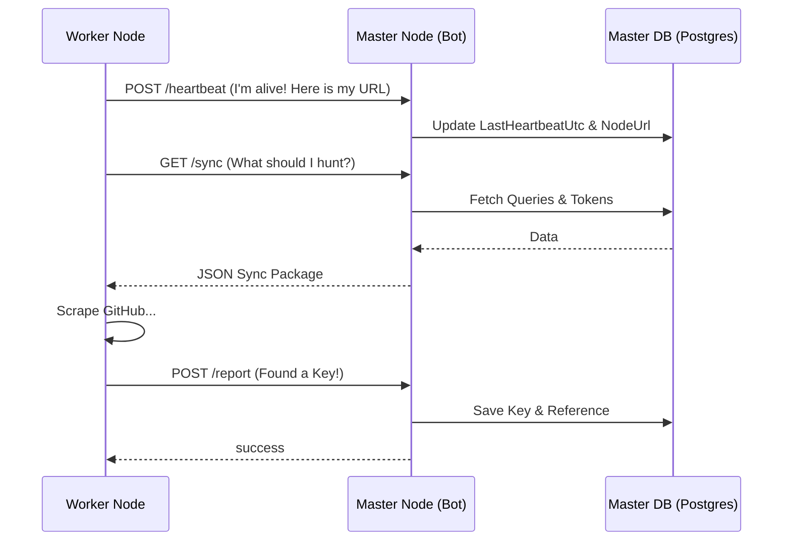

# 🧠 APIHunterV2: System Architecture (Decentralized Ghost Nodes)

This document explains the technical flow and operational logic of the Master-Worker system.

---

### 📡 1. The Handshake (Sync Process)
When a Worker Node starts up, it is essentially "empty." 
1.  **Identity**: It identifies itself using the `X-Node-Token` header.
2.  **Request**: It calls `/api/v1/nodes/sync` on the Master Node.
3.  **Payload**: The Master returns a JSON package containing:
    - **Queries**: All enabled search patterns the worker should hunt for.
    - **Global Tokens**: GitHub tokens available for public use.
    - **Personal Tokens**: Tokens specifically added by that subscriber.

### 💓 2. Heartbeats & Discovery
Workers operate in a continuous loop:
- **Ping**: Every heartbeat (5 mins), the worker reports its status and its `RENDER_EXTERNAL_URL`.
- **Finding Keys**: When a worker finds a key, it doesn't save it locally. It calls `/api/v1/nodes/report` to send the discovery to the Master.
- **Master Logic**: The Master checks for duplicates, verifies the key, and credits the specific Subscriber's ID.

### 🛡️ 3. Stateless Worker Logic
Workers carry **no local database state**. 
- **DB-Lite**: Workers use a `DBContext` but have tracking disabled (`QueryTrackingBehavior.NoTracking`).
- **No SQLite Errors**: We have patched the `ScraperService` to skip all local database writes (like `SearchQueries` updates) when `IsWorkerMode` is true.

### 🔌 4. Automated Keep-Alive (The 14-Minute Ping)
To bypass Render's Free Tier sleep mechanism:
1.  Master Node runs a background `NodeKeepAliveService`.
2.  It looks for nodes that have sent a heartbeat in the last 20 minutes.
3.  Every **14 minutes**, it sends a `GET /health` request to their reported URL.
4.  This simulated traffic "tricks" Render into keeping the instance awake 24/7.

---

### 🛠️ Data Flow Diagram

